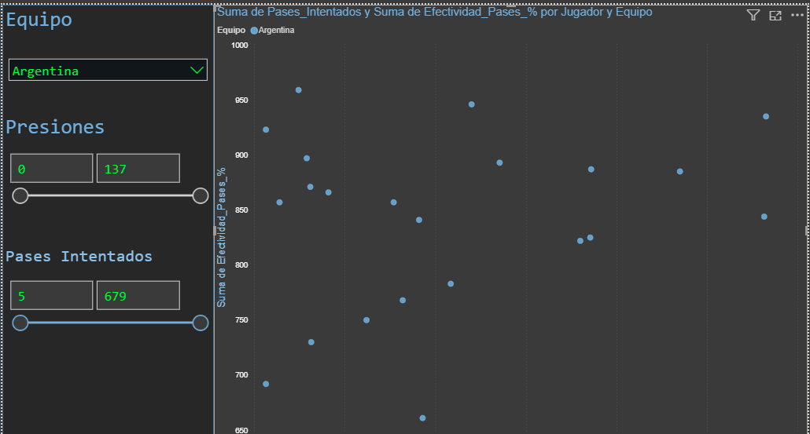
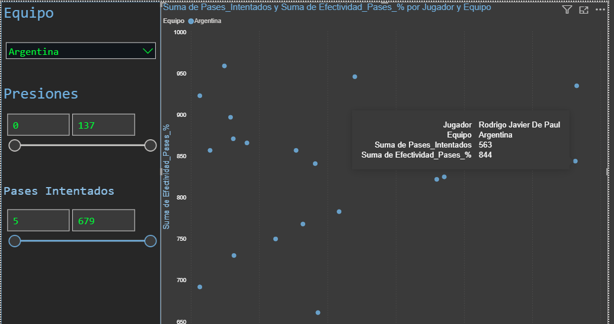
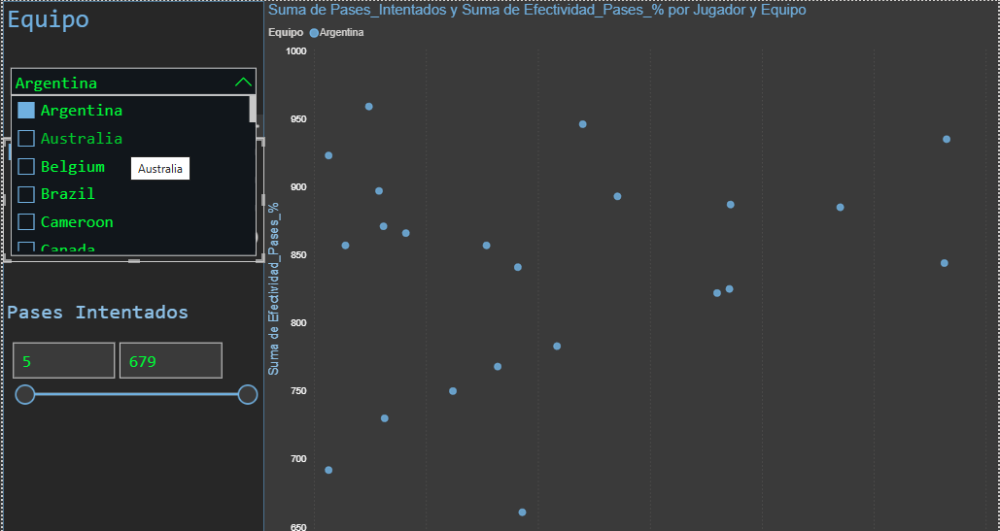
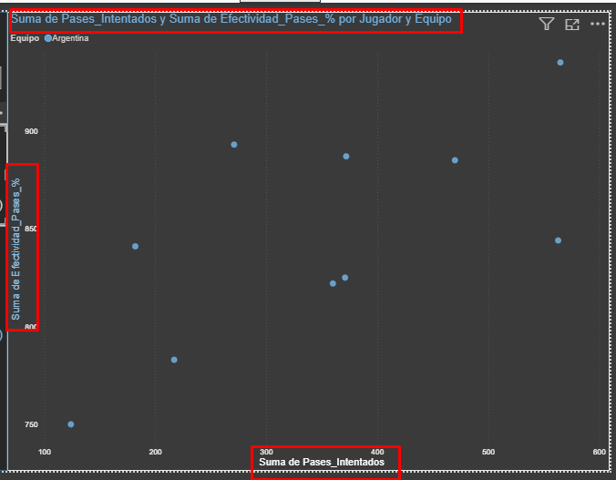

# Smart Scouting Dashboard

Analisis de rendimiento de jugadores en el Mundial Qatar 2022 usando datos de StatsBomb y visualizacion en Power BI.

## Descripcion

Este proyecto extrae, procesa y visualiza datos de eventos del Mundial Qatar 2022 para facilitar el scouting de jugadores. Un script de Python se conecta a la API de StatsBomb, extrae metricas clave de rendimiento y genera un dataset consolidado que alimenta un dashboard interactivo en Power BI.

## Objetivo

Demostrar capacidades de analisis de datos aplicadas al futbol, combinando:
- Programacion en Python para extraccion y transformacion de datos
- Analisis estadistico de rendimiento de jugadores
- Visualizacion interactiva para toma de decisiones

## Tech Stack

- **Python 3.10+** - Lenguaje principal de procesamiento
- **Pandas** - Manipulacion y agregacion de datos
- **StatsBombPy** - Conexion a la API de datos de futbol
- **TQDM** - Barra de progreso para procesamiento de partidos
- **Power BI** - Visualizacion y dashboard interactivo

## Estructura del Proyecto

```
smart-scouting-dashboard/
├── extractor_futbol.py          # Script de extraccion de datos
├── requirements.txt             # Dependencias de Python
├── datos/
│   ├── scouting_qatar_2022.csv  # Dataset consolidado de jugadores
│   ├── datos_pases_final.csv    # Datos granulares de pases
│   └── README.md                # Diccionario de datos
├── dashboards/
│   └── screenshots/             # Capturas del dashboard (proximamente)
└── docs/
    └── metodologia.md           # Metodologia del analisis
```

## Como Ejecutar

```bash
# Clonar el repositorio
git clone https://github.com/TU_USUARIO/smart-scouting-dashboard.git
cd smart-scouting-dashboard

# Crear entorno virtual (recomendado)
python -m venv .venv
.venv\Scripts\activate        # Windows
# source .venv/bin/activate   # Linux/Mac

# Instalar dependencias
pip install -r requirements.txt

# Ejecutar el extractor de datos
python extractor_futbol.py
```

Esto generara el archivo `scouting_qatar_2022.csv` con los datos actualizados.

## Resultados

El dataset generado contiene **653 jugadores** de 32 selecciones con las siguientes metricas:

- Pases intentados y completados
- Tiros y goles
- Presiones sobre el rival
- Regates intentados y exitosos
- Quitar la pelota (tackles)
- Efectividad porcentual

## Dashboard (Power BI)

El archivo `scouting.pbix` contiene un dashboard interactivo con:
- Tabla comparativa de jugadores
- Filtros por equipo, posicion y metricas
- Graficos de distribucion de rendimiento

### Capturas del Dashboard






## Proximos Pasos

- [ ] Incorporar datos de ligas europeas
- [ ] Agregar metricas avanzadas (xA, xG si estan disponibles)
- [ ] Crear version interactiva con Streamlit

## Autor

**Fernando Groba**
Tecnico en Programacion / Tecnico en Produccion y Direccion de TV

Analisis realizado como parte de formacion en **Scouting y Analisis de Datos de Futbol**.

## Licencia

Este proyecto usa datos de StatsBomb bajo su [licencia abierta](https://github.com/statsbomb/open-data).
